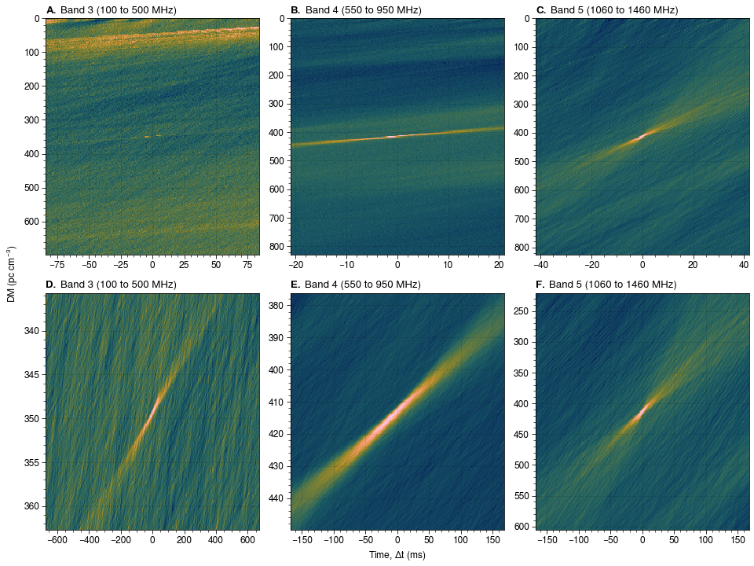

<div style="font-family:JetBrainsMono Nerd Font">
<div align="center">

[![The `candies` logo.][logo]][candies]

<center>
<sup>

The font used in the above logo is [**Candyday**][candyday] by [**Billy Argel**][billyargel].

</sup>
</center>
<br/>

![License][license-badge]
![Version][version-badge]

![Python versions][pyversions-badge]
[![Interrogate][interrogate-badge]][interrogate]

![Stars][stars-badge]
![Downloads][dm-badge]
[![Issues][issues-badge]][issues]

[![Gitmoji][gitmoji-badge]][gitmoji]
[![Code style: black][black-badge]][black]

</div>
<div align="justify">


## Contents

- [Rationale](#rationale)
- [Features](#features)
- [Installation](#installation)
- [Quick Guide](#quick-guide)

## Rationale

The [**SPOTLIGHT**][spotlight] project is a multibeam, commensal survey for FRBs and pulsars soon to be undertaken at the [**GMRT**][gmrt]. It is estimated that it will produce almost 1 PB worth of data per day[^1]. Therefore, it is obviously impossible for a mere human being, or even a group of them, to sift through and classify all the millions and billions of resulting FRB candidates. Thus, we plan to use [**`FETCH`**][fetch], a ML/DL-based classifier. However, every classifier requires some features per candidate, for both training and classification. `FETCH` requires two features to classify candidates: their **dedispersed dynamic spectrum**, and their **DM transform** (**DMT**). The authors of `FETCH` recommend using utility scripts packaged with their associated library, [**`your`**][your], to generate them: `your_candmaker.py` and `your_h5plotter.py`. However, these scripts were developed and tested using data taken from high-frequency telescopes, such as the VLA. Thus, for low-frequency data obtained via the GMRT, the features generated by these scripts proved to be sub-optimal (see the plot below). The scripts were also much slower than real time despite using the GPU.

<br/>



<small>

**Fig:** Variation of the **DM transform** (**DMT**) over different frequency bands at the GMRT. From left to right, we are going from lower to higher frequency. For real signals, we expect a bow-tie pattern in the DMT, which becomes more and more difficult to observe at lower frequencies. Plots in the first row were created using [**`your`**][your]'s `your_candmaker.py`, while plots in the second row were created via [**`candies`**][candies] for the same exact bursts.

</small>
<br/>

Thus, we decided to develop [**`candies`**][candies], our feature extraction library for FRB candidates. Primarily developed by [**me**][me] as a part of my (ongoing) PhD (and with the help of engineers from [**NVIDIA**][nvidia]), it hopes to be a better and faster variant of [**`your`**][your]'s scripts used for the same thing.

## Features

[**`candies`**][candies] plans to introduce the following features:

- [x] Zooming into the DMT (*see plots above*).
- [ ] Dealing with band-limited bursts.
- [ ] Support for GMRT's shared memory based ring buffers.

Currently, we only support processing data stored in the SIGPROC filterbank format, but support for additional formats might be added if there is any interest from the community at large.

## Installation

[**`candies`**][candies] is not on PyPI yet. To install it directly via Github, either do:

```bash
git clone https://github.com/astrogewgaw/candies
cd candies
pip install -e .
```

or do:

```bash
pip install git+https://github.com/astrogewgaw/candies
```
Mote that the `-e` flag is for an *editable install*; that is, any changes to the source code will reflect directly in your installation. If you don't want that, just remove the flag. We are trying to get [**`candies`**][candies] up on PyPI soon, which will make installing it as easy as:

```bash
pip install candies
```

## Quick Guide

For help with how to use candies, just type and run `candies` or `candies --help`. To process a list of FRB candidates stored as a CSV file, just use the command:

```bash
candies make /path/to/candidate/list
```

To see what additional options you can use, just type `candies make --help`. To plot one or several HDF5 files generated as output, just run:

```bash
candies plot /path/to/HDF5/files
```

Once more, type `candies plot --help` to see what options are available to you. You can also generate a list of candidates on the terminal, via:

```bash
candies list /path/to/HDF5/files
```

You can also use the above command to save the details as a CSV file, for later use.

[^1]: This is roughly equivalent to India's per day internet traffic!

</div>
</div>

[gitmoji]: https://gitmoji.dev
[nvidia]: https://www.nvidia.com
[me]: https://github.com/astrogewgaw
[black]: https://github.com/psf/black
[billyargel]: http://www.billyargel.com
[gmrt]: http://www.gmrt.ncra.tifr.res.in
[fetch]: https://github.com/devanshkv/fetch
[spotlight]: https://spotlight.ncra.tifr.res.in
[presto]: https://github.com/scottransom/presto
[candyday]: https://www.dafont.com/candyday.font
[candies]: https://github.com/astrogewgaw/candies
[proplot]: https://github.com/proplot-dev/proplot
[your]: https://github.com/thepetabyteproject/your
[issues]: https://github.com/astrogewgaw/candies/issues
[interrogate]: https://github.com/econchick/interrogate
[aa]: https://github.com/AstroAccelerateOrg/astro-accelerate
[logo]: https://raw.githubusercontent.com/astrogewgaw/logos/main/rasters/candies.png
[dm-badge]: https://img.shields.io/pypi/dm/candies?style=for-the-badge
[version-badge]: https://img.shields.io/pypi/v/candies?style=for-the-badge
[wheel-badge]: https://img.shields.io/pypi/wheel/candies?style=for-the-badge
[forks-badge]: https://img.shields.io/github/forks/astrogewgaw/candies?style=for-the-badge
[stars-badge]: https://img.shields.io/github/stars/astrogewgaw/candies?style=for-the-badge
[pyversions-badge]: https://img.shields.io/pypi/pyversions/candies.svg?style=for-the-badge
[issues-badge]: https://img.shields.io/github/issues/astrogewgaw/candies?style=for-the-badge
[license-badge]: https://img.shields.io/github/license/astrogewgaw/candies?style=for-the-badge
[black-badge]: https://img.shields.io/badge/code%20style-black-000000.svg?style=for-the-badge
[gitmoji-badge]: https://img.shields.io/badge/gitmoji-%20😜%20😍-FFDD67.svg?style=for-the-badge
[interrogate-badge]: https://raw.githubusercontent.com/astrogewgaw/candies/main/assets/interrogate.svg
